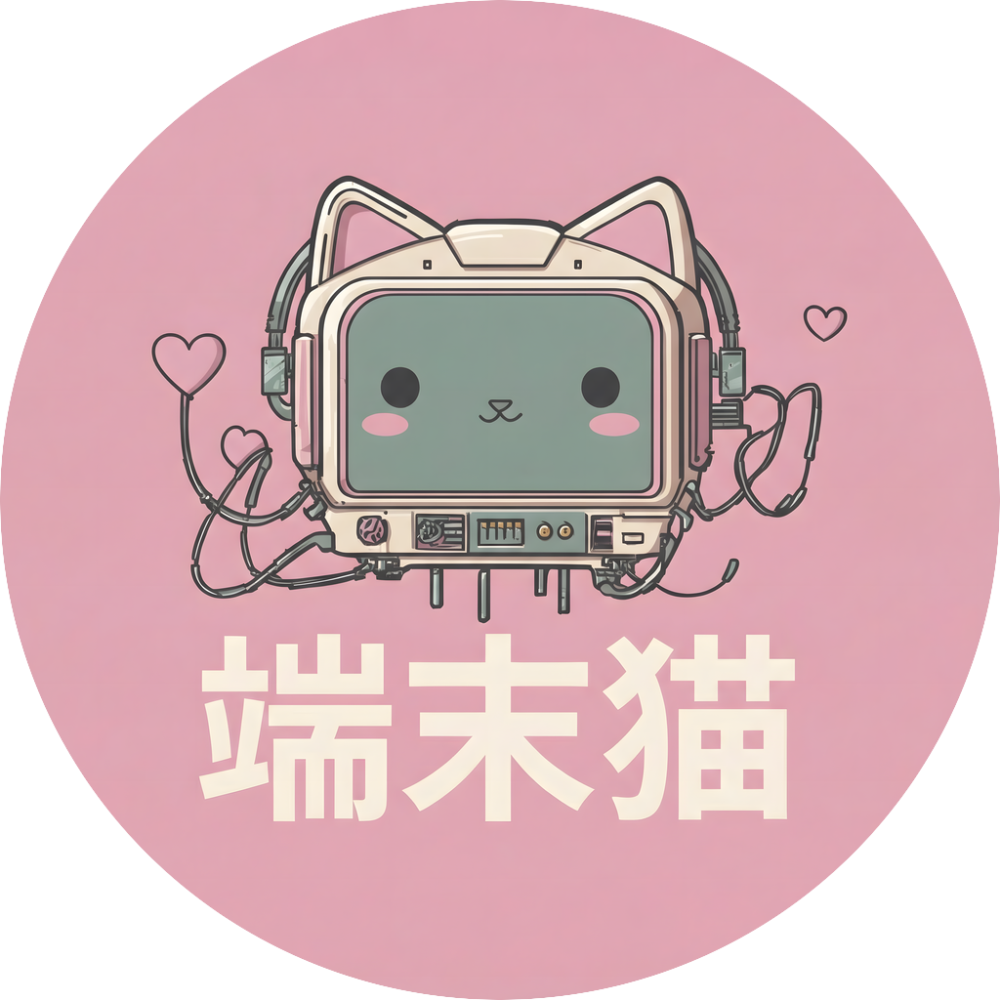

# termcat

<p align="center">
  
</p>

**Cell-based terminal I/O.** Diff rendering, cross-platform, Unicode-aware.

termcat sits between minimal libraries like [termbox2](https://github.com/termbox/termbox2) and comprehensive ones like [notcurses](https://github.com/dankamongmen/notcurses). It provides enough features for real applications—mouse input, graphics protocols, a full widget library—while staying small enough to understand and maintain.

## Features

| Category | Capabilities |
|----------|-------------|
| **Rendering** | Double-buffered diff rendering, composable planes with z-order, synchronized output (DEC 2026) |
| **Color** | True color, 256-color, 16-color with automatic downgrade based on terminal capabilities |
| **Graphics** | Kitty graphics protocol, pixel blitting (ASCII, half-block, quadrant, braille) |
| **Input** | Keyboard with modifiers, mouse tracking, bracketed paste, focus events |
| **Unicode** | Wide characters (CJK, emoji), 8 combining marks per cell, ZWJ sequences |
| **TUI** | 40+ widgets, constraint-based layout, MVU application framework, theming |
| **Platforms** | POSIX (Linux, macOS, BSD), Windows 10+ |

**Binary size**: 54KB (ReleaseSmall) for core library, 120-140KB for full TUI applications.

## Install

Add to your `build.zig.zon`:
```zig
.termcat = .{
    .url = "https://github.com/evil-mind-evil-sword/termcat/archive/refs/tags/v26.1.1.1.tar.gz",
    .hash = "...",
},
```

## Quick Start

```zig
const std = @import("std");
const termcat = @import("termcat");

pub fn main() !void {
    var gpa = std.heap.GeneralPurposeAllocator(.{}){};
    defer _ = gpa.deinit();
    const allocator = gpa.allocator();

    var term = try termcat.Terminal.init(allocator, .{});
    defer term.deinit();

    term.draw(0, 0, "Hello, termcat!", termcat.Color.green, termcat.Color.default, .{ .bold = true });
    try term.present();

    while (true) {
        if (try term.pollEvent(100)) |event| {
            switch (event) {
                .key => |key| {
                    if (key.codepoint == 'q') return;
                },
                else => {},
            }
        }
    }
}
```

## Architecture

termcat is organized in layers. Use whichever level of abstraction fits your needs.

```
┌─────────────────────────────────────────────────────────┐
│  TUI Framework (termcat.tui)                            │
│  Widgets, layout, MVU runtime, theming                  │
├─────────────────────────────────────────────────────────┤
│  Terminal                                               │
│  High-level facade: draw, present, pollEvent            │
├─────────────────────────────────────────────────────────┤
│  Renderer + Compositor                                  │
│  Double-buffered diff rendering, plane composition      │
├─────────────────────────────────────────────────────────┤
│  Backend (Posix / Windows)                              │
│  Terminal setup, capability detection, raw I/O          │
└─────────────────────────────────────────────────────────┘
```

### Core API

**Terminal** is the high-level facade for simple applications:

```zig
var term = try termcat.Terminal.init(allocator, .{});
defer term.deinit();

term.draw(0, 0, "Hello", .green, .default, .{});
try term.present();

if (try term.pollEvent(100)) |event| { ... }
```

**Backend** provides terminal setup and capability detection:

```zig
var backend = try termcat.Backend.init(allocator, .{
    .enable_mouse = true,
    .enable_focus_events = true,
    .enable_synchronized_output = true,
});
defer backend.deinit();

const size = backend.getSize();
const caps = backend.capabilities;  // color_depth, kitty_graphics, etc.
```

**Renderer** handles double-buffered diff rendering:

```zig
var renderer = try termcat.Renderer.init(allocator, size, color_depth);
const buf = renderer.buffer();
buf.print(x, y, "text", fg, bg, attrs);
try renderer.flush(backend.writer());
```

**Plane** enables composable layers:

```zig
var root = try termcat.Plane.initRoot(allocator, .{ .width = 80, .height = 24 });
defer root.deinit();

var popup = try termcat.Plane.initChild(root, 30, 7, .{ .width = 20, .height = 10 });
popup.print(0, 0, "Modal dialog", .white, .blue, .{});
```

### Colors and Attributes

```zig
// Named colors (0-15)
const red = termcat.Color.red;
const bright_cyan = termcat.Color.bright_cyan;

// 256-color palette
const color: termcat.Color = .{ .index = 196 };

// True color (24-bit RGB)
const purple = termcat.Color.fromRgb(128, 0, 255);

// HSL and grayscale
const orange = termcat.Color.fromHsl(30, 100, 50);
const gray = termcat.Color.fromGray(128);

// Attributes
const attrs: termcat.Attributes = .{ .bold = true, .italic = true };
```

Colors automatically downgrade based on terminal capabilities.

### Input Events

```zig
switch (event) {
    .key => |key| {
        if (key.codepoint) |cp| { /* regular character */ }
        if (key.special) |sp| { /* .enter, .escape, .up, .f1, etc. */ }
        if (key.mods.ctrl) { /* modifier keys */ }
    },
    .mouse => |m| { /* m.x, m.y, m.button, m.mods */ },
    .resize => |size| { /* size.width, size.height */ },
    .paste => |text| { /* bracketed paste content */ },
    .focus => |focused| { /* true = gained, false = lost */ },
}
```

## Graphics

termcat supports two graphics modes for displaying images in the terminal.

**Kitty Graphics Protocol** transmits pixel data directly to supported terminals (Kitty, Ghostty, WezTerm):

```zig
var kitty = termcat.graphics.KittyGraphics.init(allocator);
defer kitty.deinit();

try kitty.draw(backend.writer(), surface, .{
    .image_id = 1,
    .position = .{ .x = 0, .y = 0 },
    .columns = 40,
    .rows = 20,
});
```

**Pixel Blitter** renders images using Unicode characters, working in any terminal:

```zig
// Modes: .ascii (1x1), .half_block (1x2), .quadrant (2x2), .braille (2x4 pixels per cell)
termcat.PixelBlitter.blit(buffer, x, y, surface, .{
    .mode = .braille,
    .color_depth = backend.capabilities.color_depth,
});
```

## TUI Framework

termcat includes a complete widget library for building terminal applications.

### Widgets

| Category | Widgets |
|----------|---------|
| **Basic** | Label, Button, Link, Rule |
| **Input** | InputField, TextArea, Checkbox, RadioButton, Switch, Select, Autocomplete |
| **Layout** | Flex (Row/Column), Padding, Border, ScrollView, Collapsible |
| **Display** | ProgressBar, Spinner, Loading, Sparkline, DataTable, Tree |
| **Navigation** | Tabs, Modal, ScreenStack, CommandPalette |
| **Rich Text** | Markdown, Diff, Toast, Log |

### Layout System

Widgets use constraint-based layout with three allocation types:

```zig
var flex = termcat.tui.Flex.column();
flex.addChild(header,  Constraint.fromFixed(3));    // exactly 3 rows
flex.addChild(content, Constraint.fill());          // all remaining space
flex.addChild(footer,  Constraint.fromFixed(1));    // exactly 1 row
```

### MVU Application Framework

For complex applications, termcat provides an Elm-style Model-View-Update runtime:

```zig
const MyApp = termcat.tui.App(Model, Msg);

pub const app: MyApp = .{
    .initFn = init,
    .updateFn = update,
    .viewFn = view,
};

fn init(allocator: Allocator) MyApp.InitResult { ... }
fn update(model: *Model, msg: Msg) MyApp.UpdateResult { ... }
fn view(model: *const Model) termcat.tui.Widget { ... }

pub fn main() !void {
    try termcat.tui.AppRunner.run(MyApp, app, allocator, .{});
}
```

### Theming

```zig
const theme = termcat.tui.Theme{
    .text = .{ .fg = .white },
    .primary = .{ .fg = .blue, .attrs = .{ .bold = true } },
    .error_style = .{ .fg = .red },
    // ...
};
```

## Examples

```bash
zig build input_logger    # Input event debugging
zig build color_grid      # Color palette visualization
zig build demo            # Multi-plane composition
zig build graphics_demo   # Pixel blitting + Kitty graphics
zig build kanban          # TUI application example
zig build log_viewer      # Scrollable log display
zig build settings        # Configuration UI
zig build doom            # Doom in the terminal (requires WAD file)
```

The Doom demo implements the [doomgeneric](https://github.com/ozkl/doomgeneric) platform hooks using termcat for rendering and input.

## Building

```bash
zig build                          # Build library and examples
zig build test                     # Run tests
zig build -Doptimize=ReleaseSafe   # Optimized build (282KB)
zig build -Doptimize=ReleaseSmall  # Smallest build (54KB)
```

## Testing

termcat includes snapshot testing for visual regression detection:

```zig
try termcat.tui.Snapshot.expectWidget(
    allocator,
    Widget.init(Button, &button),
    .{ .width = 20, .height = 3 },
    "button_focused",
);
```

Update snapshots with `TERMCAT_UPDATE_SNAPSHOTS=1`.

## Limitations

- No sixel graphics (Kitty protocol only)
- Bracketed paste unavailable on Windows
- Single-threaded design (see architecture notes)
- Synchronized output requires terminal support (DEC 2026)

## Comparison

| Feature | termcat | termbox2 | notcurses |
|---------|---------|----------|-----------|
| Binary size | 54-140KB | ~20KB | 500KB-2MB |
| Widgets | 40+ | None | Minimal |
| Graphics | Kitty, blitting | None | Sixel, Kitty, video |
| Threading | Single | Single | Multi |
| Dependencies | None | None | ffmpeg (optional) |

termcat provides more features than termbox2 while staying smaller and simpler than notcurses.

## Related

**Classic**: [ncurses](https://invisible-island.net/ncurses/) (Thomas E. Dickey, 1996+), [termbox2](https://github.com/termbox/termbox2)

**Modern**: [notcurses](https://github.com/dankamongmen/notcurses), [crossterm](https://github.com/crossterm-rs/crossterm) (Rust), [tcell](https://github.com/gdamore/tcell) (Go), [ratatui](https://ratatui.rs/) (Rust)

## License

MIT - See [LICENSE](LICENSE) for details.
